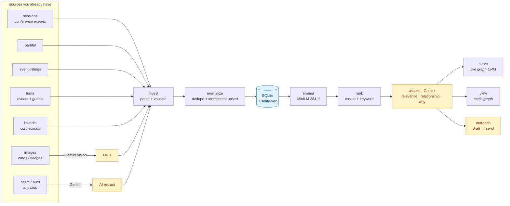
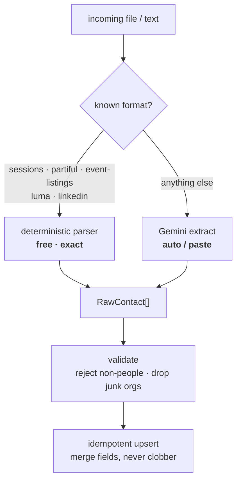
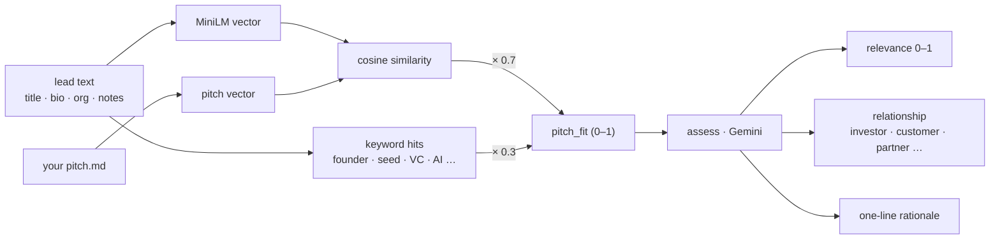
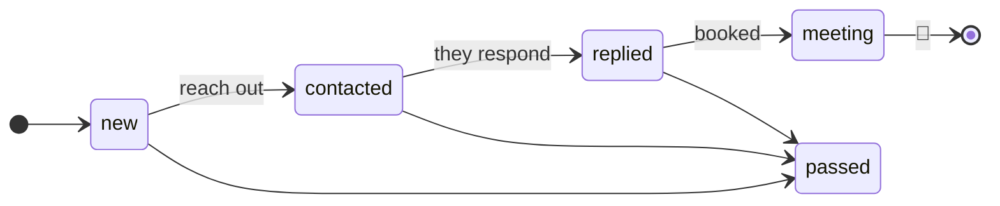
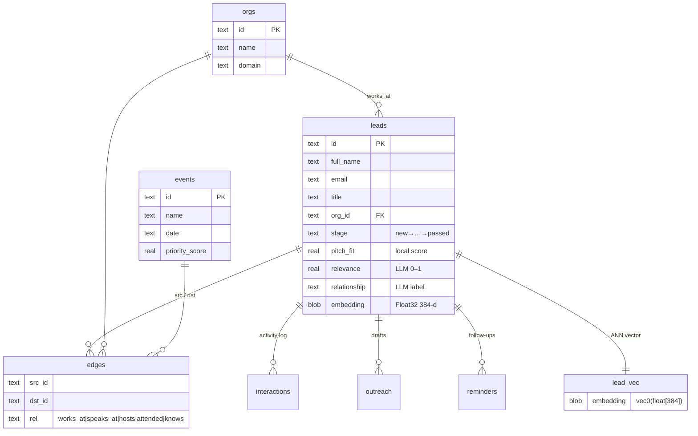
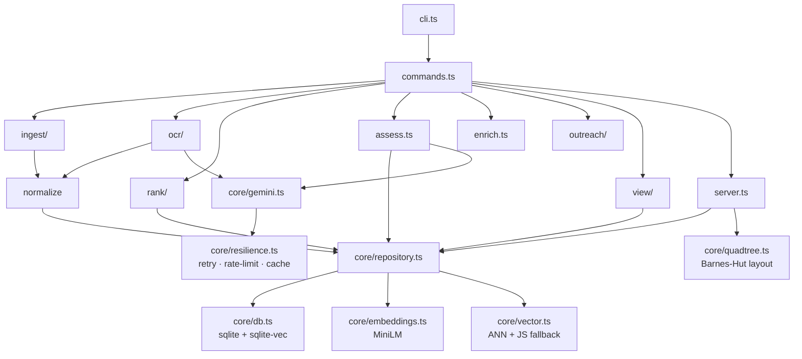
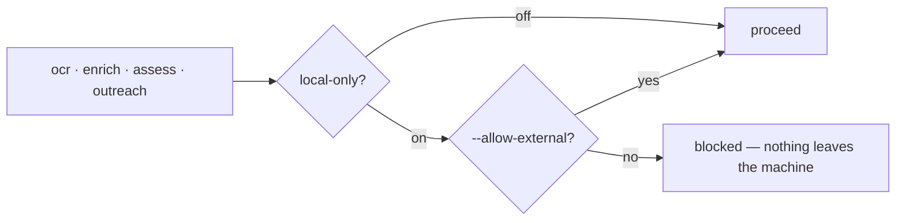

# lead-osint

> **An OSINT lead pipeline for networking and pitching your startup.** Pull
> contacts out of event exports, LinkedIn, and business-card photos; fold them
> into one embedded SQLite store; rank everyone by how well they fit your pitch
> with on-device embeddings; let an LLM tell you *how each person could matter*;
> then work the relationships in a live graph CRM and draft outreach.

<p>
  
  
  
  
  
</p>

**Local-first by design.** The CRM, the vector index, and the relationship graph
all live in a single `.db` file. Embeddings run on your machine, so ranking the
whole network costs nothing. The cloud (Gemini) is touched only for the steps
that genuinely need it — image OCR, free-text extraction, per-lead AI assessment,
and outreach drafting — and a **local-only mode** can block even those.

---

## The pipeline



Amber = the only steps that leave your machine. Everything else — parsing,
dedupe, embedding, ranking, the graph — is fully local.

---

## Install

```bash
bun install
cp .env.example .env   # add GEMINI_API_KEY (only needed for ocr / auto / assess / outreach)
```

Run with `bun run src/cli.ts <command>` (or `bun run start <command>`).

## Quick start

```bash
# 1 · bring in leads from a conference session/speaker export
bun run src/cli.ts ingest sessions test/fixtures/sessions.sample.json

# 2 · (optional) OCR business cards / badges / flyers into leads
bun run src/cli.ts ocr ./cards

# 3 · embed every lead locally (downloads MiniLM once, then cached)
bun run src/cli.ts embed

# 4 · rank everyone against your pitch
bun run src/cli.ts rank --pitch test/fixtures/pitch.md

# 5 · have the LLM judge how each person could matter
bun run src/cli.ts assess --pitch test/fixtures/pitch.md --only-new

# 6 · work the network in your browser (live CRM)
bun run src/cli.ts serve            # → http://localhost:8787

# …or do the whole chain in one shot
bun run src/cli.ts run --pitch test/fixtures/pitch.md \
  --sessions test/fixtures/sessions.sample.json --images ./cards --out crm.html
```

---

## Commands

### Ingest

| Command | What it does |
| --- | --- |
| `ingest sessions <file.json>` | Conference session/speaker export (name, email, company, title, phones, socials) |
| `ingest partiful <file.json>` | Partiful calendar; fetches event descriptions (`--no-enrich` to skip) |
| `ingest event-listings <file.json>` | Event-listing directory (same shape) |
| `ingest luma <file… \| dir>` | Luma export (events + hosts/guests). **Accepts multiple files or a folder** — merges + dedupes across events |
| `ingest linkedin <file.json>` | LinkedIn connections `[{name,bio,linkedin}]`; splits `"Title at Company"` |
| `ingest auto <file>` | **AI-normalize any JSON/text file** into leads (Gemini) |
| `ingest paste [--text "…"]` | **Paste anything** — stdin or `--text`; AI extracts leads |
| `ocr <dir> [--concurrency 4] [--min-confidence 0.45]` | Vision-OCR cards/badges/flyers → leads (Gemini) |

### Enrich · rank · assess

| Command | What it does |
| --- | --- |
| `embed [--force]` | Embed leads lacking a vector (local MiniLM); `--force` re-embeds all |
| `enrich [--github] [--exa] [--orgs] [--all]` | Fill *empty* fields from public OSINT sources, then re-embed |
| `dedupe [--apply] [--leads\|--orgs]` | Merge duplicate people + org variants (dry-run unless `--apply`) |
| `revalidate [--apply]` | Clean an existing store: drop fake-email orgs, junk orgs, non-people |
| `rank --pitch <file>` | Score every lead by pitch-fit (vector + keyword) |
| `assess --pitch <file> [--web] [--only-new] [--limit N] [--rpm N]` | LLM relevance + relationship + rationale per lead. `--web` researches each; `--only-new` skips assessed; `--rpm` throttles |

### Explore · CRM · outreach

| Command | What it does |
| --- | --- |
| `serve [--port 8787]` | **Live web CRM** — force-graph + table; stage/note/reminder/draft edits persist |
| `view [--out crm.html]` | Static interactive graph (ego mode; **Trace path** highlights a chain) |
| `search "<query>" [--k 20]` | Hybrid semantic + keyword search, with match reasons |
| `path "<you>" "<target>"` | Warm-intro path: shortest chain via shared org/event |
| `next [--stage new] [--limit 15]` | Call-list: who to contact next, by fit + stage |
| `vcs [--out f]` (alias `firms`) | VC firms in your network + warm contacts (`--all` for every investor firm) |
| `stage <id\|name\|email> <stage>` | Move a lead: new→contacted→replied→meeting→passed |
| `note <id\|name\|email> "text"` | Append a note + log an interaction |
| `remind <id\|name> <3d\|2026-07-01> ["note"]` | Set a follow-up (`remind done <id>` clears it) |
| `due [--all]` | Follow-ups due / overdue |
| `export [csv\|vcard] [--stage s] [--relationship r] [--min-fit n]` | Export contacts (defaults CSV → `out/leads.csv`) |
| `dump [--out out/dump] [--format json\|md\|both]` | Full dossier dump of every lead |
| `outreach draft [--top 10] [--pitch f]` | Generate drafts (stored, **never auto-sent**) |
| `outreach list [--status draft]` · `outreach send --id <id> --yes` | List / send one draft over SMTP (gated, opt-in) |
| `forget <id\|email\|linkedin\|name> [--yes]` | **Erase** a lead + all their data (GDPR/CCPA) |
| `run …` | End-to-end: ingest → embed → rank → view (+ optional drafts) |
| `stats` | Store counts |

---

## Drop in anything

Known formats parse deterministically — free, instant, exact. Everything else is
AI-normalized into the lead model:

```bash
# a scraped JSON blob of any shape
bun run src/cli.ts ingest auto ./linkedin-dump.json

# or just paste / pipe text
pbpaste | bun run src/cli.ts ingest paste
bun run src/cli.ts ingest paste --text "Met Jane Doe, CTO @ Acme, jane@acme.com — building robotics"
```



---

## How scoring works

Two independent signals, then an LLM judgment on top:



- **`rank`** is local + free: `pitch_fit = 0.7·cosine(lead, pitch) + 0.3·keywordHit`.
  The semantic term captures meaning ("she builds inference infra" matches an
  AI-infra pitch with no shared words); the keyword term rewards explicit signal.
  Tune with `--semantic-weight` / `--keyword-weight` and the vocabulary in
  [`src/ingest/keywords.ts`](src/ingest/keywords.ts).
- **`assess`** adds an LLM layer: a 0–1 business relevance, a **relationship**
  label (`investor`, `customer`, `partner`, `connector`, `advisor`, `expert`,
  `hire`, `peer`, `other`), and a short *why*. Gemini calls fall back across model
  versions and retry transient errors, so a retired model or a 503 won't sink a run.

---

## The CRM loop



```bash
lead-osint dedupe --apply                 # fold duplicate people + org variants
lead-osint next --limit 20                # ranked call-list
lead-osint path "You" "Brex"              # how are you connected?
lead-osint stage "Ada Sample" contacted
lead-osint note "Ada Sample" "Met at the mixer — wants a demo next week"
```

The graph opens in **ego mode** (your top leads + their immediate network) and
expands as you click; flip *Scope* to **Everyone** for the full picture.

---

## Data model

One SQLite file (`LEAD_OSINT_DB`, default `data/leads.db`):



- **edges** drive the graph: `works_at` / `speaks_at` / `hosts` / `attended` / `knows`.
- **lead_vec** is a `sqlite-vec` `vec0(float[384])` ANN index, with a pure-JS
  cosine fallback if the extension can't load.
- Re-running any ingest is **idempotent** — leads dedupe by email (or name+org)
  and fields merge rather than overwrite.

**Validation** ([`src/ingest/validate.ts`](src/ingest/validate.ts)) keeps junk out:
non-people are rejected, generic/self/email-like company strings are dropped, and
free-email domains (gmail, outlook, …) never define an org — so strangers don't
collapse into a fake "gmail" hub.

---

## Architecture



```text
src/
  core/      config · errors · db · repository · schema · ids · text · concurrency
             embeddings (MiniLM) · vector · gemini · resilience · quadtree · dates
  ingest/    sessions · partiful · event-listings · luma · linkedin
             ai-extract · keywords · normalize · validate · types
  ocr/       gemini-ocr · ingest-images
  rank/      pitch · relevance        assess.ts  LLM relevance/relationship/why
  outreach/  draft · send             enrich.ts  github · exa · wikidata + edgar
  view/      graph-html · dashboard · dump        search.ts · paths.ts · export.ts
  server.ts  Bun HTTP + JSON API      dedupe.ts · revalidate.ts
  commands.ts CLI handlers   cli.ts entry   index.ts library API
```

---

## Configuration

| Env | Required for | Default |
| --- | --- | --- |
| `GEMINI_API_KEY` (or `GOOGLE_API_KEY`) | `ocr`, `ingest auto`/`paste`, `assess`, `outreach draft` | — |
| `GEMINI_OCR_MODEL` / `GEMINI_TEXT_MODEL` | — | `gemini-2.5-flash` |
| `EXA_API_KEY` | `enrich --exa` | — |
| `GITHUB_TOKEN` | optional — raises `enrich --github` rate limit | — |
| `SEC_USER_AGENT` | recommended for `enrich --orgs` (SEC EDGAR etiquette) | — |
| `SMTP_HOST`/`SMTP_PORT`/`SMTP_USER`/`SMTP_PASSWORD`/`OUTREACH_FROM_EMAIL` | `outreach send` | — |
| `LEAD_OSINT_DB` | — | `data/leads.db` |
| `LEAD_OSINT_LOCAL_ONLY` | privacy switch (see below) | off |

### Privacy / local-only



Set `LEAD_OSINT_LOCAL_ONLY=1` (or pass `--local-only`) to block any command that
would transmit a lead's data to a third party; add `--allow-external` to permit a
single run. Use `forget` to honor a deletion request.

---

## Development

```bash
bun run tsc     # typecheck
bun run lint    # biome
bun test        # unit + integration (in-memory sqlite-vec)
```

## Ethics & legal

Use this only on data you're allowed to process. Ingest from sources you have
access to, respect each site's terms and rate limits (network steps keep bounded
concurrency + timeouts), don't store data you shouldn't, and keep outreach
consensual — sending is deliberately one-at-a-time and opt-in. Secrets live in
`.env` (git-ignored); none are committed.

## License

MIT © Mike Odnis
